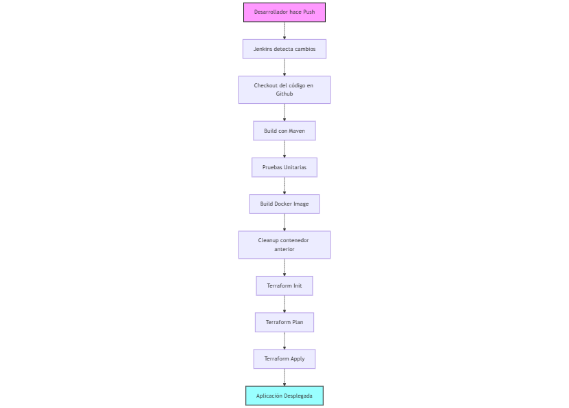
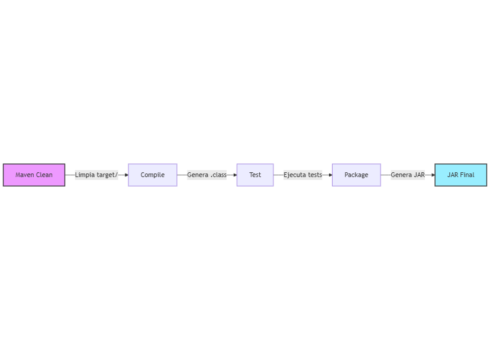
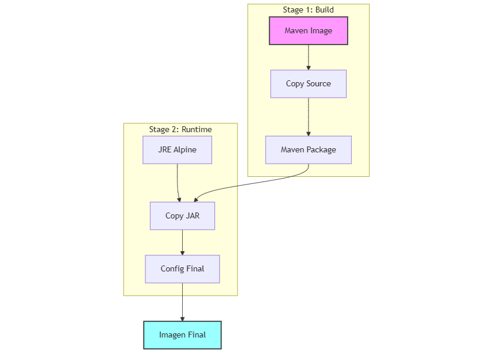
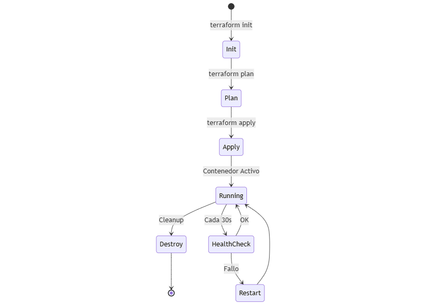

# Documentación de la Implementación de CI/CD para Aplicación Java con GitHub, Jenkins, Docker y Terraform 

**Autor:** Daniel Araya Rocha  
**Fecha:** 07 de Diciembre 2024

## Introducción

Este documento describe la implementación de un pipeline CI/CD para una aplicación Java utilizando GitHub, Jenkins, Docker y Terraform. El objetivo es automatizar completamente el proceso de construcción, prueba y despliegue de la aplicación en un entorno local simulado mediante contenedores Docker, gestionados por Terraform.

## Arquitectura del Pipeline

El pipeline implementa un flujo de trabajo CI/CD completo que incluye:
- Integración Continua (CI): compilación y pruebas
- Entrega Continua (CD): construcción de imagen Docker y despliegue
- Infraestructura como Código (IaC): gestión de contenedores con Terraform

## Diagramas de Flujo

### 1. Flujo General CI/CD


Este diagrama representa el proceso completo desde que un desarrollador realiza un push hasta que la aplicación está desplegada. El flujo incluye:
1. Push del desarrollador
2. Detección de cambios por Jenkins
3. Checkout del código en Github
4. Build con Maven
5. Ejecución de pruebas
6. Construcción de imagen Docker
7. Limpieza de contenedores
8. Inicialización de Terraform
9. Planificación de infraestructura
10. Aplicación de cambios
11. Despliegue final

### 2. Proceso de Build con Maven


El proceso de build con Maven sigue el siguiente flujo:
- **Maven Clean**: Limpia el directorio target/
- **Compile**: Genera los archivos .class
- **Test**: Ejecuta las pruebas unitarias
- **Package**: Genera el archivo JAR final

### 3. Proceso de Build Docker Multi-stage


El proceso de construcción Docker se divide en dos etapas:

**Stage 1: Build**
- Utiliza imagen base de Maven
- Copia el código fuente
- Ejecuta el empaquetado Maven

**Stage 2: Runtime**
- Utiliza imagen base JRE Alpine
- Copia solo el JAR necesario
- Configura la imagen final

### 4. Flujo de Terraform


El ciclo de vida de la infraestructura gestionado por Terraform:
- **Init**: Inicialización de providers
- **Plan**: Planificación de cambios
- **Apply**: Aplicación de la infraestructura
- **Running**: Contenedor en ejecución
- **HealthCheck**: Monitoreo continuo
- **Restart**: Recuperación automática si es necesario

  
## Requisitos Previos

- **Java**: OpenJDK 17
- **Maven**: Versión 3.9.9
- **Jenkins**: Versión 2.479.2
- **Docker**: Versión 27.3.1
- **Terraform**: Versión 1.9.8
- **Git**: Última versión

## Configuración del Repositorio GitHub

1. Creación del repositorio:

   Inicializar repositorio local
   ```bash
   git init
   ```
   Añadir repositorio remoto
   ```bash
   git remote add origin https://github.com/DevandMlOps/devops.git
   ```
   Realizar primer commit y push
   ```bash
   git add .
   git commit -m "Implementación inicial del pipeline CI/CD"
   git push -u origin main
   ```
2. Estructura del Repositorio:
   ```
    .
    ├── Dockerfile
    ├── Jenkinsfile
    ├── README.md
    ├── pom.xml
    ├── src
    │   ├── main
    │   │   ├── java
    │   │   │   └── com
    │   │   │       └── demo
    │   │   │           ├── Application.java
    │   │   │           ├── controller
    │   │   │           │   └── HealthController.java
    │   │   │           └── service
    │   │   │               └── HealthService.java
    │   │   └── resources
    │   │       └── application.properties
    │   └── test
    │       └── java
    │           └── com
    │               └── demo
    │                   └── controller
    │                       └── HealthControllerTest.java
    └── terraform
        └── main.tf
  
   ```

## Flujo de Trabajo Jenkins

### 1. Checkout del Código
- Jenkins se conecta al repositorio Git usando credenciales configuradas
- Descarga el código fuente más reciente de la rama main
- Prepara el workspace para la compilación

### 2. Compilación con Maven
- Jenkins utiliza la herramienta Maven configurada (versión 3.9.9)
- Ejecuta el comando `mvn clean package`:
  - `clean`: limpia el directorio target
  - `package`: compila el código y crea el JAR
- El archivo JAR resultante se almacena en `target/*.jar`

### 3. Pruebas Unitarias
- Ejecuta `mvn test` para las pruebas unitarias
- Utiliza JUnit para procesar los resultados
- Genera reportes en `target/surefire-reports/`
- Los resultados se publican en Jenkins usando el plugin JUnit

### 4. Construcción de Imagen Docker
- Jenkins construye la imagen Docker usando un Dockerfile multi-etapa:
  ```dockerfile
  # Etapa de construcción
  FROM maven:3.9.9-eclipse-temurin-17 AS build
  WORKDIR /app
  COPY . .
  RUN mvn clean package -DskipTests

  # Etapa de ejecución
  FROM eclipse-temurin:17-jre-alpine
  WORKDIR /app
  COPY --from=build /app/target/*.jar app.jar
  ```
- La imagen final se etiqueta como `java-health-app:latest`
- Se optimiza el tamaño usando una imagen base Alpine

### 5. Limpieza de Contenedores
- Elimina cualquier contenedor existente con el mismo nombre
- Asegura un despliegue limpio sin conflictos

## Gestión de Infraestructura con Terraform

### 1. Inicialización
- Terraform inicializa el provider de Docker
- Descarga los plugins necesarios
- Prepara el entorno de trabajo

### 2. Planificación
- Crea un plan de ejecución
- Determina los cambios necesarios en la infraestructura
- Genera un archivo de plan (`tfplan`)

### 3. Aplicación
- Ejecuta el plan generado
- Gestiona el ciclo de vida del contenedor Docker
- Configura la red y los puertos

### Configuración de Terraform
El archivo `main.tf` define:
```hcl
resource "docker_container" "java_app" {
  name  = "java-health-app"
  image = docker_image.java_app.name

  ports {
    internal = 8080
    external = 9090
  }

  restart = "unless-stopped"

  healthcheck {
    test = ["CMD", "wget", "-q", "--spider", "http://localhost:8080/health"]
    interval = "30s"
    timeout  = "10s"
    retries  = 3
  }
}
```

### Características de la Infraestructura
- **Contenedor**: gestiona un único contenedor Docker
- **Puertos**: mapea el puerto interno 8080 al puerto externo 9090
- **Reinicio**: configurado para reiniciar automáticamente
- **Healthcheck**: monitoreo de salud cada 30 segundos

## Endpoints Disponibles

- `GET /`: Mensaje de bienvenida
- `GET /health`: Estado de la aplicación

##  Verificación del Despliegue

Para verificar que todo está funcionando correctamente:

1. Verifique el mensaje de bienvenida:
```bash
curl http://localhost:9090/
```
Respuesta esperada: "Bienvenido a la API de Demo"

2. Verifique el estado de salud:
```bash
curl http://localhost:9090/health
```
Respuesta esperada:
```json
{
    "status": "UP",
    "version": "1.0.0"
}
```

3. Verificar el estado del contenedor
```bash
docker ps
```

4. Ver logs del contenedor
```bash
docker logs java-health-app
```

## Mantenimiento y Actualización

Para desplegar actualizaciones:
1. Commit y push de los cambios al repositorio
2. Jenkins detectará los cambios y ejecutará el pipeline
3. Terraform gestionará la actualización del contenedor

## Resolución de Problemas

Problemas comunes y soluciones:
1. **Puerto en uso**: verificar que el puerto 9090 esté disponible
2. **Fallo en healthcheck**: revisar logs del contenedor
3. **Errores de permisos**: verificar permisos de Docker y Jenkins

## Uso de IA Generativa en el Proyecto

Durante el desarrollo de este proyecto, se utilizó Claude (Anthropic) como herramienta de asistencia. A continuación, se detalla el uso ético y responsable de la IA:

### Consultas Realizadas y Adaptaciones

1. **Configuración del Pipeline**
   - **Consulta**: "Crea un Jenkinsfile para una aplicación Java con etapas de build, test y deploy usando Docker y Terraform"
   - **Uso**: Se adaptó la respuesta para incluir las etapas específicas requeridas y la gestión de credenciales de GitHub

2. **Dockerfile Multi-etapa**
   - **Consulta**: "Cómo optimizar un Dockerfile para una aplicación Java Spring Boot"
   - **Uso**: Se implementó la sugerencia de usar build multi-etapa para reducir el tamaño de la imagen

3. **Configuración de Terraform**
   - **Consulta**: "Configuración de Terraform para gestionar contenedores Docker localmente"
   - **Uso**: Se adaptó la configuración para incluir healthchecks y gestión de puertos

4. **Documentación**
   - **Consulta**: "Generar documentación técnica del pipeline CI/CD con diagramas"
   - **Uso**: Se utilizó como base para crear una documentación más detallada y personalizada

### Ética y Buenas Prácticas

- Se utilizó la IA como herramienta de asistencia, no como sustituto del conocimiento
- Cada sugerencia fue analizada, comprendida y adaptada al contexto específico
- No se compartió información sensible en las consultas
- Se mantuvieron las mejores prácticas de seguridad y desarrollo

## Conclusiones

La implementación exitosa de este pipeline CI/CD demuestra la eficacia de la integración entre Jenkins, Docker y Terraform para automatizar el ciclo de vida completo de una aplicación Java. El uso responsable de IA generativa permitió optimizar el proceso de desarrollo mientras se mantenían las mejores prácticas de la industria.

